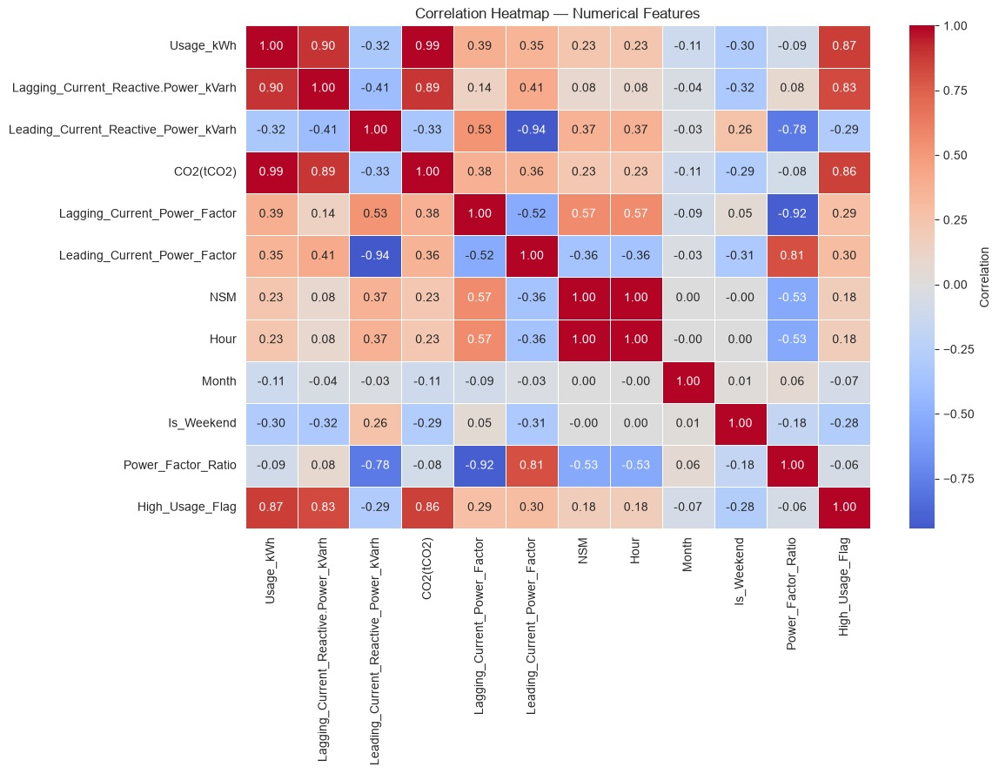
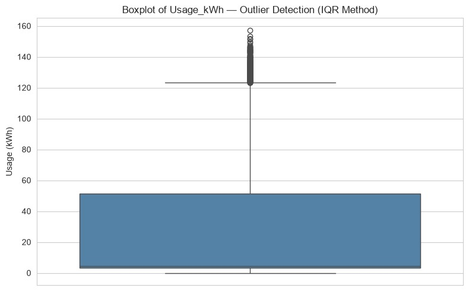
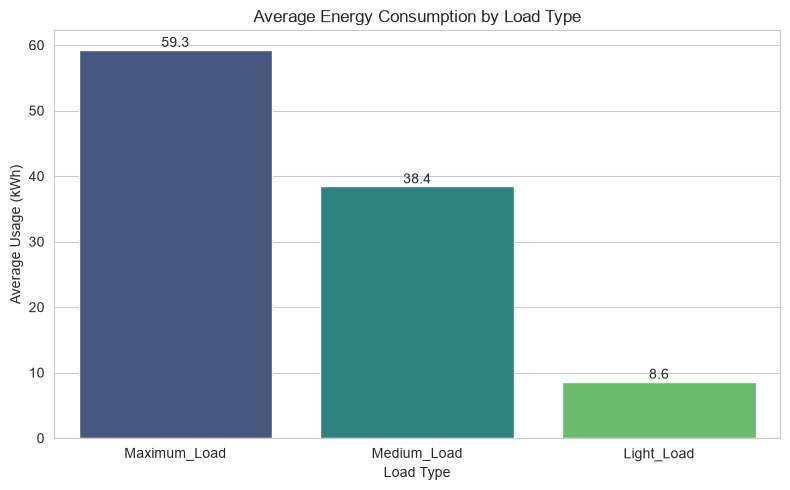
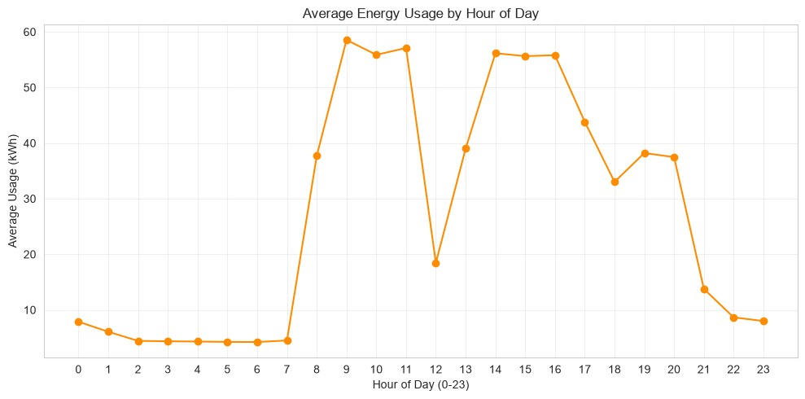
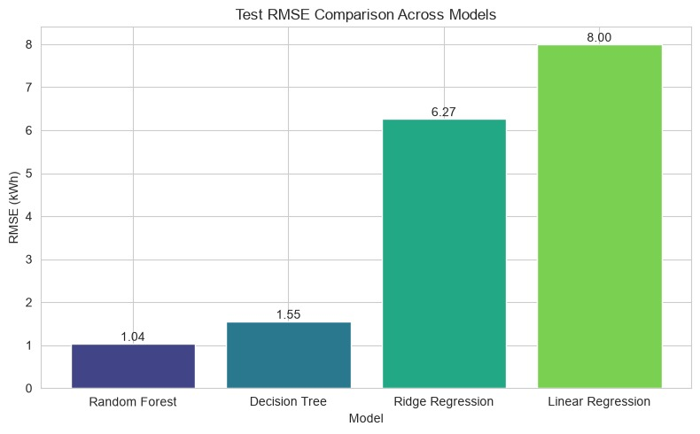
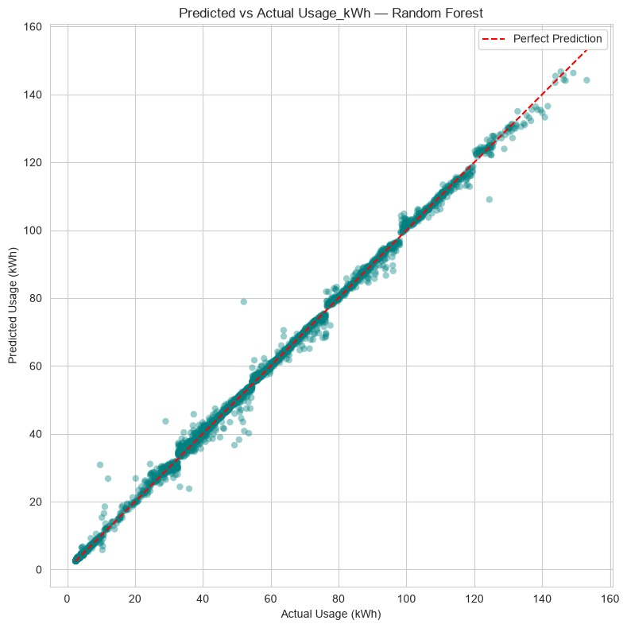

# Steel Industry Energy Consumption — EDA & Baseline Regression Modeling

**Week 2 Project** | AI/ML Engineering

This repository contains a two-part machine learning workflow on the
[UCI Steel Industry Energy Consumption Dataset](https://archive.ics.uci.edu/dataset/851/steel+industry+energy+consumption):

1. **Part 1 — Deep Exploratory Data Analysis & Feature Engineering** (`notebooks/week2_eda.ipynb`)
2. **Part 2 — Baseline Regression Modeling** (`notebooks/week2_modeling.ipynb`)

Together, these represent the full core workflow of a real machine learning
project: understand the data, engineer useful features, then train and
evaluate multiple models to establish a documented baseline.

---

## Table of Contents

- [Dataset](#dataset)
- [Project Structure](#project-structure)
- [Setup & Installation](#setup--installation)
- [Part 1 — EDA & Feature Engineering](#part-1--eda--feature-engineering)
- [Part 2 — Baseline Regression Modeling](#part-2--baseline-regression-modeling)
- [Model Selection Summary](#model-selection-summary)
- [Key Takeaways](#key-takeaways)
- [Author](#author)

---

## Dataset

| | |
|---|---|
| **Name** | Steel Industry Energy Consumption Dataset |
| **Source** | UCI Machine Learning Repository |
| **Link** | https://archive.ics.uci.edu/static/public/851/steel+industry+energy+consumption.zip |
| **Size** | 35,040 rows × 11 columns (15-minute interval readings over 1 full year) |
| **Target** | `Usage_kWh` — energy consumption in kilowatt-hours |

**Raw columns:** `date`, `Usage_kWh`, `Lagging_Current_Reactive.Power_kVarh`,
`Leading_Current_Reactive_Power_kVarh`, `CO2(tCO2)`,
`Lagging_Current_Power_Factor`, `Leading_Current_Power_Factor`, `NSM`
(seconds from midnight), `WeekStatus`, `Day_of_week`, `Load_Type`.

> The dataset is **not committed to this repository**. Download it from the
> link above, unzip it, and place `Steel_industry_data.csv` inside the
> `data/` folder before running the notebooks. See `data/README.md` for
> exact steps.

---

## Project Structure

```
steel-energy-project/
├── data/
│   ├── Steel_industry_data.csv             
│   ├── Steel_industry_data_engineered.csv   
│                             
├── notebooks/
│   ├── week2_eda.ipynb                       
│   └── week2_modeling.ipynb                  
├── screenshots/                               
├── requirements.txt
└── README.md                                  
```

---
## Part 1 — EDA & Feature Engineering

**Notebook:** `notebooks/week2_eda.ipynb`

### What was done

| Step | Description |
|---|---|
| Structure check | Loaded raw CSV, checked shape, dtypes, missing values, duplicates |
| Datetime features | Converted `date` to datetime; extracted `Hour`, `DayOfWeek`, `Month`, `Is_Weekend` |
| Redundancy cleanup | Dropped raw `Day_of_week` / `WeekStatus` columns (duplicated the new date-derived features) |
| `Power_Factor_Ratio` | `Leading_Current_Power_Factor ÷ Lagging_Current_Power_Factor` |
| `High_Usage_Flag` | Binary flag: 1 if `Usage_kWh` > 75th percentile, else 0 |
| Outlier detection | IQR method on `Usage_kWh` + boxplot |
| Correlation analysis | Heatmap of all numerical features + top-3 correlated with `Usage_kWh` |
| Load Type comparison | Grouped bar chart of average usage by `Load_Type` |
| Hourly pattern | Line chart of average usage by hour of day |
| Output | Saved `data/Steel_industry_data_engineered.csv` for Part 2 |

### Data quality findings

- **Zero missing values** and **zero duplicate rows** across all 35,040 rows — the raw dataset is clean.
- `Usage_kWh` is heavily right-skewed (median 4.57 kWh vs. mean 27.4 kWh).
- IQR method flagged **328 rows (0.94%)** as outliers, all on the high end — these correspond to genuine `Maximum_Load` periods, not sensor errors, so they were kept.

### Correlation Heatmap



**Top 3 features correlated with `Usage_kWh`:**

| Feature | Correlation |
|---|---|
| `CO2(tCO2)` | 0.99 |
| `Lagging_Current_Reactive.Power_kVarh` | 0.90 |
| `Lagging_Current_Power_Factor`* | 0.39 |

\* `High_Usage_Flag` (r = 0.87) was excluded from the ranking since it is
engineered directly from the target and does not count as an independent
predictor — see Part 2 for how this leakage is handled.

### Outlier Detection (Boxplot)




### Average Energy Consumption by Load Type



| Load Type | Average Usage (kWh) |
|---|---|
| Maximum_Load | 59.3 |
| Medium_Load | 38.4 |
| Light_Load | 8.6 |

### Average Energy Usage by Hour of Day



Usage follows a clear **double-hump daily cycle**: near-zero overnight
(hours 0–7), a sharp rise at hour 8, peaking around hours 9–11 (~56–58 kWh),
a lunchtime dip at hour 12 (~18.6 kWh), a second peak from hours 13–16, then
a steady evening decline.

### EDA Summary

> **Data quality:** The dataset had zero missing values and zero duplicates;
> the only issue was 328 high-side outliers in `Usage_kWh` (0.94% of rows),
> which reflect genuine `Maximum_Load` operation rather than errors.
> **Top correlated features:** `CO2(tCO2)` (r = 0.99) and
> `Lagging_Current_Reactive.Power_kVarh` (r = 0.90) — both scale directly
> with active electrical load. **Most interesting pattern:** a strong
> double-hump daily cycle with a sharp midday dip, likely a shift-change or
> break window. **Hypothesis on spikes:** energy spikes are
> schedule-driven — they align with `Maximum_Load` operations running during
> working-hour shifts rather than random equipment behavior.

*(Full 250-word summary is in `notebooks/week2_eda.ipynb`, Section 10.)*

---

## Part 2 — Baseline Regression Modeling

**Notebook:** `notebooks/week2_modeling.ipynb`

### What was done

| Step | Description |
|---|---|
| Load data | Loaded `data/Steel_industry_data_engineered.csv` from Part 1 |
| Leakage removal | Dropped `date` (raw timestamp) and `High_Usage_Flag` (derived directly from the target) |
| NaN handling | `Power_Factor_Ratio` had 1 NaN (from a `Lagging_Current_Power_Factor = 0` division guard) — imputed with the median |
| Encoding | One-hot encoded `Load_Type` and `DayOfWeek` (`drop_first=True`) — see reasoning below |
| Split | 80% train / 20% test, `random_state=42` |
| Models trained | Linear Regression, Ridge Regression, Decision Tree Regressor, Random Forest Regressor |
| Evaluation | MAE, RMSE, R² on the test set + 5-fold cross-validation RMSE |

### Why one-hot encoding (not label encoding)?

`Load_Type` and `DayOfWeek` have **no natural ordinal relationship** — label
encoding would impose a false numeric order (e.g. treating "Friday" as
greater than "Monday"), which would bias linear models in particular. Both
columns have low cardinality (3 and 7 categories), so one-hot encoding
doesn't cause a dimensionality problem. `drop_first=True` avoids the dummy
variable trap for the linear/ridge models.

### Test Set Results

| Model | Test MAE | Test RMSE | Test R² | CV Mean RMSE (5-fold) |
|---|---|---|---|---|
| Linear Regression | 5.616 | 8.001 | 0.9437 | 7.909 ± 0.082 |
| Ridge Regression | 4.360 | 6.267 | 0.9655 | 6.229 ± 0.092 |
| Decision Tree | 0.552 | 1.555 | 0.9979 | 1.421 ± 0.062 |
| **Random Forest** | **0.347** | **1.040** | **0.9990** | **1.010 ± 0.075** |

### Test RMSE Comparison

<!-- Add screenshot: RMSE bar chart from week2_modeling.ipynb, Section 9 -->


### Predicted vs Actual — Best Model (Random Forest)

<!-- Add screenshot: scatter plot from week2_modeling.ipynb, Section 10 -->


Predictions track the perfect-prediction line closely across the full range
(0–160 kWh), with only minor scatter around the 30–50 kWh and 70–80 kWh
bands.

---

## Model Selection Summary

**Best model: Random Forest Regressor**

- Lowest test RMSE (1.040 kWh) and highest test R² (0.9990) of all 4 models.
- Lowest 5-fold CV RMSE (1.010 ± 0.075), and it is nearly identical to its
  test RMSE — meaning it generalizes consistently rather than overfitting
  to one particular split.
- Both linear models (Linear Regression, Ridge) trail far behind the
  tree-based models, confirming the relationship between the electrical
  readings/time features and `Usage_kWh` is substantially **non-linear**.
  Ridge's regularization gave a meaningful improvement over plain Linear
  Regression (RMSE 6.267 vs. 8.001), suggesting some multicollinearity
  among the electrical readings.

**Signs of overfitting:**

- The **Decision Tree** shows the clearest overfitting signature — test
  RMSE (1.555) is noticeably higher than its CV RMSE (1.421), since an
  unconstrained tree fits training data almost perfectly and is more
  sensitive to the exact train/test split.
- The **Random Forest** shows almost no test/CV gap (1.040 vs 1.010) —
  averaging across 200 trees smooths out that variance.
- **Linear Regression** and **Ridge** show low variance (test RMSE ≈ CV
  RMSE) but high bias (much higher absolute error) — they underfit rather
  than overfit.

**Model carried forward:** **Random Forest Regressor**, as the baseline for
future weeks. Next steps include hyperparameter tuning
(`max_depth`, `n_estimators`, `min_samples_leaf`) and feature importance
analysis to further improve and interpret this baseline.

*(Full write-up is in `notebooks/week2_modeling.ipynb`, Section 11.)*

---

## Key Takeaways

- The dataset is clean (no missing values, no duplicates), so most of the
  engineering effort went into deriving useful time-based and ratio
  features rather than data cleaning.
- Energy usage is driven almost entirely by physical load — `CO2(tCO2)` and
  reactive power are near-perfect proxies for `Usage_kWh`, and usage follows
  a strong, predictable daily production cycle.
- Tree-based ensembles (Random Forest) massively outperform linear models
  on this dataset, confirming non-linear interactions between load type,
  time of day, and electrical readings drive consumption.
- `High_Usage_Flag`, engineered in Part 1 for EDA purposes, was correctly
  identified and dropped in Part 2 to prevent target leakage before
  modeling.

## Author

**Kiran Aslam** 
